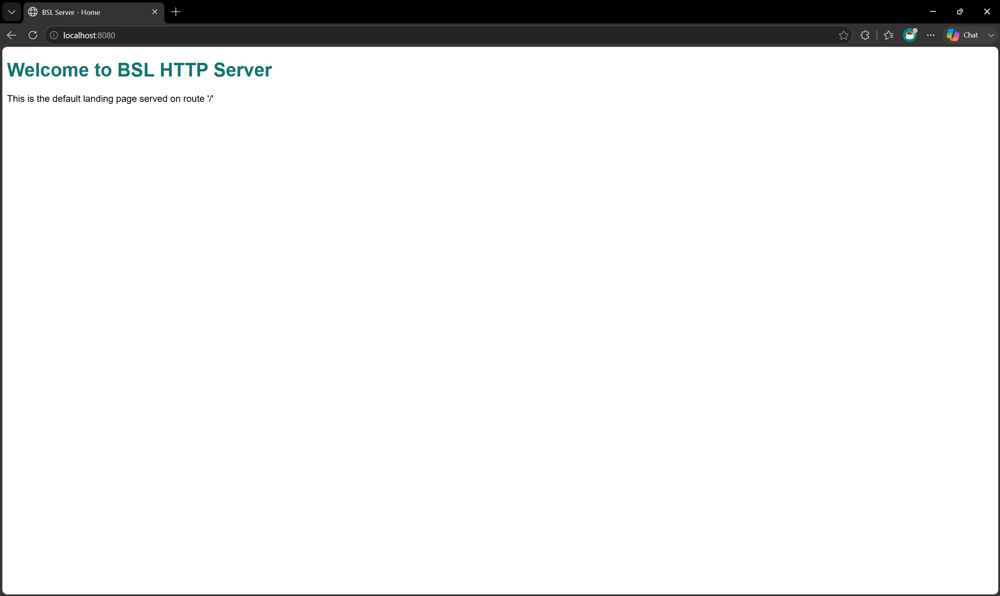
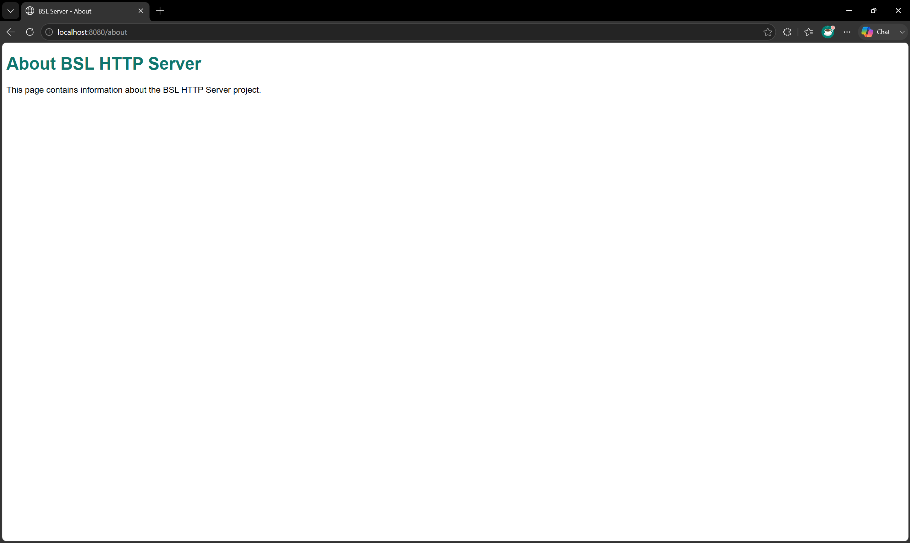
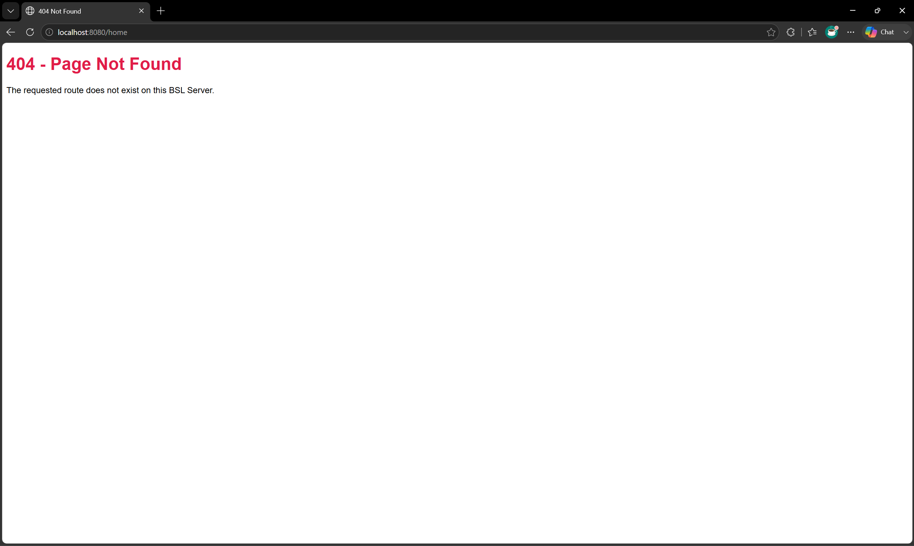
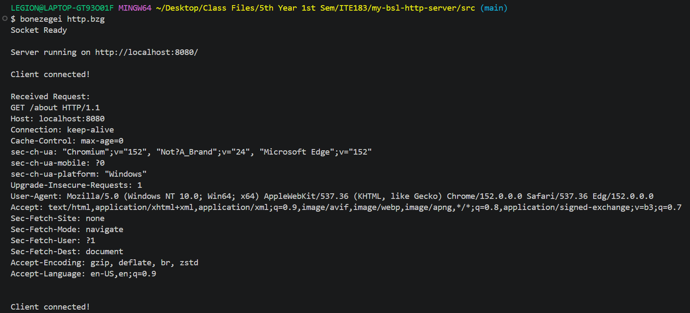

# my-bsl-http-server

BSL HTTP Server is a low-level HTTP Web Server using the Bonezegei Scripting Language (BSL) and the BSL Socket Library. It demonstrates raw TCP socket handling and simple route-based request dispatch (/, /about, and a 404 fallback) without any external web framework.

## Requirements

- [Bonezegei Scripting Language (BSL)](https://github.com/bonezegei/Bonezegei_Scripting_Language) interpreter installed
- The `BSL_Socket` package, installed via BSL's package manager

## Installation

1. Install the BSL interpreter (Windows via Microsoft Store, or Linux/Raspberry Pi via `.deb` — see the [BSL install guide](https://bonezegei.com/tutorials/bsl/install)).
2. Verify the install:
```bash
   bonezegei --version
```
3. Clone this repository:
```bash
   git clone https://github.com/utthee/my-bsl-http-server.git
   cd my-bsl-http-server/src
```
4. Install the socket library (run from inside `src/`, since `http.bzg` includes it via a relative path):
```bash
   bzg install socket
```

## Usage
 
From inside the `src/` directory:
 
```bash
bonezegei http.bzg
```
 
You should see:
 
```
Socket Ready
Server running on http://localhost:8080/
```
 
Then open a browser to `http://localhost:8080/`.

## Routes
 
| Route                    | Response                          |
| ------------------------ | ---------------------------------- |
| `/`                      | 200 OK — landing page              |
| `/about`                 | 200 OK — about page                |
| any other path e.g. /home, /user, /anything, etc.   | 404 Not Found — fallback page      |

## Documentations
 
### Home (`/`)

The landing page returned with a `200 OK` when visiting `http://localhost:8080/`.
 
### About (`/about`)

The about page returned with a `200 OK` when visiting `http://localhost:8080/about`.
 
### 404 (unmapped route e.g. /home, /user, /anything, etc.)

The fallback `404 Not Found` page returned for any route the server doesn't explicitly handle.
 
### Terminal output

The server running in a terminal, showing startup logs, connection logs, and incoming HTTP request.
 
## License
 
This project is licensed under the [MIT License](LICENSE).